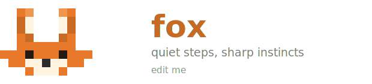

<div align="center">



# fox

**The fastest local LLM server. Drop-in replacement for Ollama.**

[](https://github.com/ferrumox/fox/actions/workflows/ci.yml)
[](LICENSE-MIT)
[](CHANGELOG.md)
[](https://rustup.rs/)
[](https://github.com/ferrumox/fox/stargazers)

[](https://github.com/sponsors/manuelslemos)

</div>

**Fox is free forever.** No asterisks. No "free for now." No pivot to paid. Dual-licensed MIT OR Apache-2.0, always.

---

## Try it in 30 seconds

```bash
# Linux / macOS
curl -fsSL https://github.com/ferrumox/fox/releases/latest/download/install.sh | sh

# Windows
irm https://raw.githubusercontent.com/ferrumox/fox/main/install.ps1 | iex
```

```bash
# Pull a model and start
fox pull llama3.2
fox serve

# Ask something (OpenAI-compatible)
curl http://localhost:8080/v1/chat/completions \
  -H "Content-Type: application/json" \
  -d '{"model":"llama3.2","messages":[{"role":"user","content":"Hello!"}],"stream":true}'

# If you already use Ollama — just change the port from 11434 to 8080. That's it.
```

---

## Performance vs Ollama

RTX 4060 · Llama-3.2-3B-Instruct-Q4_K_M · 4 concurrent clients · 50 requests:

<!-- BENCH_TABLE_START -->
| Metric | fox | Ollama | Improvement |
|--------|-----|--------|-------------|
| First token (P50) | 87ms | 310ms | **+72%** |
| First token (P95) | 134ms | 480ms | **+72%** |
| Response time (P50) | 412ms | 890ms | **+54%** |
| Response time (P95) | 823ms | 1740ms | **+53%** |
| Throughput | 312 t/s | 148 t/s | **+111%** |
<!-- BENCH_TABLE_END -->

> Reproduce: `./scripts/benchmark.sh llama3.2 4 50`

---

## Why is fox faster?

**Conversations get faster over time.** Fox remembers the context it already processed — system prompts and previous messages aren't re-read from scratch on every turn. Ollama does. In a long conversation, fox skips up to 75% of that work from the second message onward, which is why the first token arrives much sooner.

**Multiple users don't block each other.** Fox processes several requests at the same time instead of waiting for one to finish before starting the next. A long generation for one user doesn't delay a quick question from another.

---

## Works with every tool you already use

**No code changes needed** — just change the base URL to `http://localhost:8080`.

| Client / Tool | Protocol | Status |
|---------------|----------|--------|
| Open WebUI | Ollama | ✓ Works out of the box |
| Continue.dev | Ollama | ✓ Works out of the box |
| LangChain | OpenAI | ✓ Works out of the box |
| LlamaIndex | OpenAI | ✓ Works out of the box |
| Cursor / Copilot Chat | OpenAI | ✓ Works out of the box |
| `ollama` CLI | Ollama | ✓ Works out of the box |
| `openai` Python SDK | OpenAI | ✓ Works out of the box |

### Python

```python
from openai import OpenAI

client = OpenAI(base_url="http://localhost:8080/v1", api_key="sk-local")

resp = client.chat.completions.create(
    model="llama3.2",
    messages=[{"role": "user", "content": "Say hi in 5 words."}],
)
print(resp.choices[0].message.content)
```

### Node.js

```ts
import OpenAI from "openai";

const openai = new OpenAI({ baseURL: "http://localhost:8080/v1", apiKey: "sk-local" });

const resp = await openai.chat.completions.create({
  model: "llama3.2",
  messages: [{ role: "user", content: "Say hi in 5 words." }],
});
console.log(resp.choices[0].message?.content);
```

### IDE configuration

**VSCode / Cursor**
```json
{ "github.copilot.advanced": { "serverUrl": "http://localhost:8080" } }
```

**Continue.dev** (`~/.continue/config.json`)
```json
{
  "models": [{
    "title": "fox (local)",
    "provider": "openai",
    "model": "llama3.2",
    "apiBase": "http://localhost:8080/v1"
  }]
}
```

See [`examples/`](examples/) for more integration guides.

---

## GPU support

Fox detects CUDA, ROCm, Metal, and Vulkan at runtime — **one binary runs on any hardware**.

| Platform | GPU backends | Auto-detects |
|----------|-------------|--------------|
| Linux x86_64 | CUDA + ROCm + Vulkan | ✅ |
| Windows x86_64 | CUDA + Vulkan | ✅ |
| macOS Apple Silicon | Metal | ✅ |
| macOS Intel | CPU only | — |
| Linux ARM64 | CPU only | — |

Auto-detection priority: **CUDA → ROCm → Vulkan → Metal → CPU**.

---

## Installation

### Linux / macOS

```bash
curl -fsSL https://github.com/ferrumox/fox/releases/latest/download/install.sh | sh
```

Or download a binary directly:

```bash
# Linux x86_64
curl -L https://github.com/ferrumox/fox/releases/latest/download/fox-linux-x86_64 -o fox && chmod +x fox

# macOS Apple Silicon
curl -L https://github.com/ferrumox/fox/releases/latest/download/fox-macos-arm64 -o fox && chmod +x fox

# macOS Intel
curl -L https://github.com/ferrumox/fox/releases/latest/download/fox-macos-x86_64 -o fox && chmod +x fox
```

### Windows

```powershell
irm https://raw.githubusercontent.com/ferrumox/fox/main/install.ps1 | iex
```

Or download [`fox-windows-x86_64.exe`](https://github.com/ferrumox/fox/releases/latest/download/fox-windows-x86_64.exe) directly.

### Build from source

```bash
git clone --recurse-submodules https://github.com/ferrumox/fox
cd fox
cargo build --release
```

GPU backend is detected at runtime — no recompilation needed when switching between CPU, CUDA, and Metal.

### Docker

```bash
docker run -p 8080:8080 \
  -v ~/.cache/ferrumox/models:/root/.cache/ferrumox/models \
  ferrumox/fox serve

# Or with docker compose
docker compose up
```

---

## Usage

```bash
# Search HuggingFace for GGUF models
fox search gemma
fox search qwen coder --limit 5

# Pull a model
fox pull llama3.2            # top result, balanced quantization
fox pull gemma3:12b          # specific size
fox pull gemma3:12b-q4       # specific quantization
fox pull bartowski/gemma-3-12b-it-GGUF  # specific HF repo

# Start the server
fox serve                    # lazy loading — no model needed upfront
fox serve --max-models 3     # keep up to 3 models loaded simultaneously

# Interactive REPL
fox run
fox run "Explain ownership in Rust"  # single-shot

# Manage models
fox list                     # list downloaded models
fox show llama3.2            # model info: architecture, quantization, size
fox ps                       # list currently loaded models
fox models                   # browse curated model catalogue
fox rm llama3.2              # remove a downloaded model

# Manage aliases
fox alias set llama3 Llama-3.2-3B-Instruct-Q4_K_M
fox alias list

# Benchmark
fox bench llama3.2
fox bench llama3.2 --runs 10

# Benchmark KV cache quantization types side by side
fox bench-kv llama3.2
fox bench-kv llama3.2 --types f16,q8_0,q4_0 --runs 3
```

---

## API endpoints

| Method | Path | Description |
|--------|------|-------------|
| POST | `/v1/chat/completions` | Chat completions — streaming + non-streaming (OpenAI) |
| POST | `/v1/completions` | Text completions (OpenAI) |
| POST | `/v1/embeddings` | Embeddings (OpenAI) |
| GET | `/v1/models` | List all models on disk (OpenAI) |
| GET | `/v1/models/:model` | Single model info (OpenAI) |
| POST | `/api/chat` | Chat — NDJSON streaming (Ollama) |
| POST | `/api/generate` | Generate — NDJSON streaming (Ollama) |
| POST | `/api/embed` | Embeddings (Ollama) |
| GET | `/api/tags` | List models on disk (Ollama) |
| GET | `/api/ps` | List loaded models (Ollama) |
| POST | `/api/show` | Model metadata (Ollama) |
| DELETE | `/api/delete` | Remove a model file (Ollama) |
| POST | `/api/pull` | Pull a model from HuggingFace (SSE) |
| POST | `/api/copy` | Duplicate a model under a new name (Ollama) |
| POST | `/api/create` | Create a model from a Modelfile (Ollama) |
| POST | `/api/models/:name/load` | Load a model into memory on demand |
| POST | `/api/models/:name/unload` | Evict a loaded model from memory |
| GET | `/api/version` | Server version — for Ollama client detection |
| GET | `/health` | Health + KV cache metrics |
| GET | `/metrics` | Prometheus scrape endpoint |

---

## Features

- Runs any GGUF model (Llama, Mistral, Gemma, Qwen, DeepSeek, and more)
- **OpenAI-compatible API** — works with any tool that supports OpenAI
- **Ollama-compatible API** — works with any tool that supports Ollama
- **Multi-model serving** — keep multiple models loaded, switch between them instantly
- **Lazy loading** — no need to specify a model upfront; fox loads it on first request
- **Prefix caching** — shared system prompts are processed once and reused across requests
- **Continuous batching** — multiple concurrent users processed in parallel, not serialized
- **Multi-GPU support** — automatic layer-split distribution across all GPUs; configurable via `--split-mode`, `--tensor-split`, `--main-gpu`
- **MoE CPU offload** — run DeepSeek, Mixtral and other MoE models with expert layers in RAM via `--moe-cpu`
- **Function calling** and **structured JSON output** (OpenAI spec)
- **Request cancellation** — closing the connection immediately frees GPU memory
- **KV cache quantization** — `f16`, `q8_0`, `q4_0`
- **CORS** — permissive headers on all routes; web apps can call the API directly
- **API key authentication** — optional `FOX_API_KEY` for access control
- **Prometheus metrics** — latency, throughput, KV cache usage out of the box
- **Config file** at `~/.config/ferrumox/config.toml`
- **Aliases** — short names instead of full model filenames
- **Docker** and **systemd** support included

---

## Configuration

All flags can also be set via environment variable or `~/.config/ferrumox/config.toml`.

| Flag | Env | Default | Description |
|------|-----|---------|-------------|
| `--model-path` | `FOX_MODEL_PATH` | — | GGUF model to pre-load (optional; supports nested paths) |
| `--port` | `FOX_PORT` | `8080` | Bind port |
| `--host` | `FOX_HOST` | `0.0.0.0` | Bind host |
| `--max-models` | `FOX_MAX_MODELS` | `1` | Max models in memory simultaneously (LRU eviction) |
| `--keep-alive-secs` | `FOX_KEEP_ALIVE_SECS` | `300` | Evict idle models after N seconds (0 = never) |
| `--max-context-len` | `FOX_MAX_CONTEXT_LEN` | auto | Context window size (auto-detects from model if omitted) |
| `--gpu-memory-fraction` | `FOX_GPU_MEMORY_FRACTION` | `0.85` | Fraction of GPU RAM allocated to the KV cache |
| `--type-kv` | `FOX_TYPE_KV` | `f16` | KV cache type for both K and V: `f16`, `q8_0`, `q4_0` |
| `--type-k` | `FOX_TYPE_K` | — | Override K cache type independently (same values as `--type-kv`) |
| `--type-v` | `FOX_TYPE_V` | — | Override V cache type independently (same values as `--type-kv`) |
| `--main-gpu` | `FOX_MAIN_GPU` | `0` | Primary GPU index (0-based) |
| `--split-mode` | `FOX_SPLIT_MODE` | `layer` | Multi-GPU split: `none`, `layer` (layer distribution), `row` (tensor-parallel) |
| `--tensor-split` | `FOX_TENSOR_SPLIT` | auto | Comma-separated VRAM proportions, e.g. `"3,1"` for 75%/25% (omit for auto-balance) |
| `--moe-cpu` | `FOX_MOE_CPU` | `false` | Offload MoE expert layers to CPU RAM (DeepSeek, Mixtral) |
| `--max-batch-size` | `FOX_MAX_BATCH_SIZE` | `32` | Continuous batch size |
| `--swap-fraction` | `FOX_SWAP_FRACTION` | `0.0` | GPU↔CPU KV-cache swap space fraction |
| `--block-size` | `FOX_BLOCK_SIZE` | `16` | Tokens per KV block |
| `--system-prompt` | `FOX_SYSTEM_PROMPT` | `"You are a helpful assistant."` | System prompt injected in every request |
| `--api-key` | `FOX_API_KEY` | — | Require `Authorization: Bearer <key>` on all requests |
| `--hf-token` | `HF_TOKEN` | — | HuggingFace token for private repos |
| `--alias-file` | `FOX_ALIAS_FILE` | `~/.config/ferrumox/aliases.toml` | Short name → model stem mapping |
| `--json-logs` | `FOX_JSON_LOGS` | `false` | Structured JSON logs |

### Config file (`~/.config/ferrumox/config.toml`)

```toml
port = 8080
max_models = 3
keep_alive_secs = 300
system_prompt = "You are a helpful assistant."

# KV cache quantization (f16, q8_0, q4_0)
type_kv = "f16"
# type_k = "q8_0"     # override K independently
# type_v = "f16"      # override V independently

# Multi-GPU
split_mode = "layer"   # none | layer | row
# main_gpu = 0
# tensor_split = "3,1" # manual VRAM proportions

# MoE CPU offload (DeepSeek, Mixtral)
# moe_cpu = true
```

### Aliases (`~/.config/ferrumox/aliases.toml`)

```toml
[aliases]
"llama3"   = "Llama-3.2-3B-Instruct-Q4_K_M"
"mistral"  = "Mistral-7B-Instruct-v0.3-Q4_K_M"
```

---

## Benchmark

```bash
# Compare fox vs Ollama side by side
./target/release/fox-bench \
  --url http://localhost:8080 \
  --compare-url http://localhost:11434 \
  --model llama3.2

# JSON output for CI
./target/release/fox-bench \
  --url http://localhost:8080 \
  --compare-url http://localhost:11434 \
  --model llama3.2 \
  --output json

# Reproducible benchmark vs Ollama
./scripts/benchmark.sh llama3.2 4 50
```

Sample output:

```
┌─────────────────┬──────────────┬──────────────┬──────────┐
│ Metric          │     fox      │    ollama    │ Δ        │
├─────────────────┼──────────────┼──────────────┼──────────┤
│ TTFT P50        │          87ms│         310ms│ +72%     │
│ TTFT P95        │         134ms│         480ms│ +72%     │
│ Latency P50     │         412ms│         890ms│ +54%     │
│ Latency P95     │         823ms│        1740ms│ +53%     │
│ Latency P99     │        1204ms│        2600ms│ +54%     │
│ Throughput      │    312.4 t/s │    148.1 t/s │ +111%    │
└─────────────────┴──────────────┴──────────────┴──────────┘
```

---

## Project structure

```
fox/
├── src/
│   ├── main.rs              # Entry point, config, signal handling
│   ├── metrics.rs           # Prometheus metrics registry
│   ├── config.rs            # Config file loading
│   ├── registry.rs          # Model discovery helpers
│   ├── model_registry/      # Multi-model registry (DashMap) + LRU eviction, loader
│   ├── api/                 # REST API (OpenAI + Ollama compat)
│   │   ├── router.rs        # Axum router setup
│   │   ├── routes.rs        # Route table
│   │   ├── auth.rs          # API key middleware
│   │   ├── error.rs         # Unified error types
│   │   ├── pull_handler.rs  # POST /api/pull SSE streaming
│   │   ├── types/           # Request/response types (v1, ollama, embeddings, …)
│   │   ├── v1/              # OpenAI-compat handlers (chat, completions, embeddings, models)
│   │   ├── ollama/          # Ollama-compat handlers (chat, generate, embed, management)
│   │   └── shared/          # Shared helpers (inference, streaming, digest, extractor)
│   ├── scheduler/           # Continuous batching + prefix cache
│   ├── kv_cache/            # PagedAttention-style ref-counted block manager
│   ├── engine/              # Inference engine, sampling, output filtering
│   │   └── model/llama_cpp/ # llama.cpp FFI backend (+ fox_stub no-op model)
│   └── cli/                 # Subcommands: serve, run, pull, list, rm, show, probe, ps, models, search, alias, bench, bench-kv
├── examples/
│   ├── curl.sh              # curl examples for all API routes
│   ├── langchain.py         # LangChain integration
│   └── openwebui.md         # Open WebUI setup guide
├── scripts/
│   └── benchmark.sh         # Reproducible benchmark vs Ollama
├── vendor/llama.cpp/        # Git submodule
├── Dockerfile
├── docker-compose.yml
├── fox.service              # systemd unit
├── install.sh               # One-liner installer
├── Makefile
├── CHANGELOG.md
└── Cargo.toml
```

---

## Make targets

```
make build           Compile release binaries (fox + fox-bench)
make run             Build and start the server
make dev             Start with RUST_LOG=debug
make test            Run unit tests
make check           Fast type-check (cargo check)
make bench           Run fox-bench against a running server
make docker          Build Docker image
make docker-run      Start via docker compose
make install-rust    Install Rust toolchain
make download-model  Download default model (Llama-3.2-3B Q4_K_M)
```

---

## Requirements

| Backend | Requirement |
|---------|-------------|
| CPU | x86_64 or arm64, AVX2 |
| CUDA | CUDA 12.x, Linux/Windows x86_64 |
| ROCm | ROCm 6.2+, Linux x86_64 |
| Metal | macOS 13+, Apple Silicon |
| Vulkan | Vulkan SDK 1.3+, Linux or Windows x86_64 |

No runtime dependencies beyond GPU drivers — single static binary.

---

## Community

- **Bug reports**: [GitHub Issues](https://github.com/ferrumox/fox/issues)
- **Discussions**: [GitHub Discussions](https://github.com/ferrumox/fox/discussions)
- **Changelog**: [CHANGELOG.md](CHANGELOG.md)
- **Contributing**: [CONTRIBUTING.md](CONTRIBUTING.md)

To run tests:

```bash
FOX_SKIP_LLAMA=1 cargo test --all
```

---

## Support the project

Fox is built and maintained by [Manuel S. Lemos](https://github.com/manuelslemos) in his spare time. It's free forever — no paid tiers, no feature gating, no VC money.

If fox saves you time or replaces a paid API bill, consider sponsoring:

| | |
|---|---|
| ☕ **$5 / month** | Coffee tier — eternal gratitude + sponsor badge |
| 🐛 **$25 / month** | Bug priority — your issues move to the front of the queue + name in [SPONSORS.md](SPONSORS.md) |
| 🏢 **$100 / month** | Team supporter — your logo in the README + shoutout in every release |
| 🚀 **$500 / month** | Infrastructure partner — direct line + input on the roadmap |

[**❤️ GitHub Sponsors**](https://github.com/sponsors/manuelslemos) · [**☕ Buy Me a Coffee**](https://buymeacoffee.com/manuelslemos)

> 100% of sponsorships go toward keeping fox free and actively maintained.

---

## License

Dual-licensed under [MIT](LICENSE-MIT) or [Apache 2.0](LICENSE-APACHE) — your choice.
