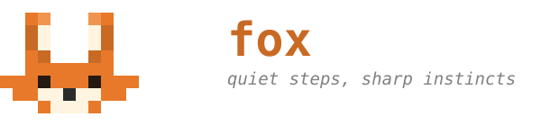
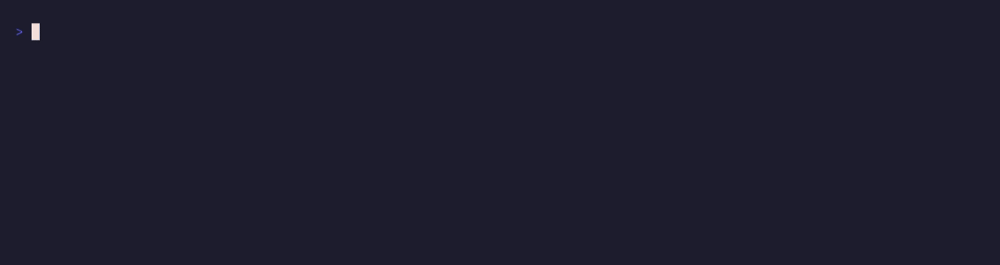

<div align="center">



**A local LLM server built for concurrent work. Drop-in replacement for Ollama.**

[](https://github.com/ferrumox/fox/actions/workflows/ci.yml)
[](LICENSE-MIT)
[](CHANGELOG.md)
[](https://rustup.rs/)
[](https://github.com/ferrumox/fox/stargazers)

[](https://github.com/sponsors/manuelslemos)



</div>

Fox is dual-licensed MIT OR Apache-2.0 and stays that way. There is no paid tier and no plan for one.

---

## Try it in 30 seconds

```bash
# Linux x86_64 — picks the Vulkan build when a GPU is present, CPU otherwise
curl -fsSL https://github.com/ferrumox/fox/releases/latest/download/install.sh | sh
```

macOS and Windows: build from source (below), or run the Linux installer under WSL2.
Prebuilt binaries are Linux x86_64 for now.

```bash
# Pull a model and start (qwen3.6 is 22 GB; qwen3.5 is 2.7 GB if you want a quicker first run)
fox pull qwen3.6
fox serve

# Ask something (OpenAI-compatible)
curl http://localhost:8080/v1/chat/completions \
  -H "Content-Type: application/json" \
  -d '{"model":"qwen3.6","messages":[{"role":"user","content":"Hello!"}],"stream":true}'

# If you already use Ollama — just change the port from 11434 to 8080. That's it.
```

---

## Performance

Fox wraps llama.cpp, so a single request decoding on its own runs the same kernels
`llama-server` runs. There is no room for fox to be dramatically faster at that, and it
isn't. Where fox pulls ahead is when requests arrive together and share a prompt.

Radeon 890M, Vulkan, Llama-3.2-1B-Instruct-Q8_0, 1856-token shared system prompt.
Both servers built from the same vendored llama.cpp, one running at a time, arms
alternated across 3 rounds. All ranges below are disjoint.

| Workload | fox | llama-server |
|---|---|---|
| 8 clients, shared prompt, cold — TTFT p50 | **1129 ms** | 4550 ms |
| 16 clients, shared prompt, cold — TTFT p50 | **1402 ms** | 8064 ms |
| 16 clients, whole burst wall clock | **3.8 s** | 16.2 s |
| 4 clients, short unrelated prompts — throughput | 96% of llama-server | baseline |

Doubling the clients costs fox 24% more time to first token and `llama-server` 79%.

That last row is not a typo and it is not buried on purpose: on single-turn requests with
short prompts, fox is about 4% behind. That workload cannot see any of the work fox does,
because there is no prompt worth reusing. If your traffic looks like that, fox will not
make it faster.

Reproduce either one:

```bash
scripts/ab_shared_prefix.sh    # concurrent burst behind a shared prompt
scripts/ab_bench.sh            # decode-bound throughput
```

Full methodology, including two ways these benchmarks produced convincing wrong answers
before they produced right ones, is in `docs/design/rocm-benchmarking-2026-08.md`.

Numbers against Ollama are pending re-measurement on current hardware. The figures that
used to sit here were from an RTX 4060 with no recorded methodology, and this project's
rule is that a before/after claim comes from `scripts/ab_bench.sh` or it does not get
published.

---

## How it works

**Sequences remember what they hold.** Every sequence keeps the tokens resident in its
KV cache, including the tokens it generated. A new request is matched to the sequence
sharing the longest prefix with it and skips the prefill for that overlap. In a chat, the
second turn does not re-read the first.

**Requests can copy a prefix from a live sequence.** This is the part other llama.cpp
servers do not do. Slot affinity normally reuses an idle sequence, so when eight requests
carrying the same system prompt arrive at once, none of them can reuse anything and all
eight prefill the same tokens. Fox copies the shared prefix out of a sibling that is
already decoding. `llama-server` cannot: its slot selection skips busy slots in both its
similarity pass and its LRU fallback.

**A shared prefix is paid for once.** Sequences sharing a prefix share the block budget
for it instead of each reserving a copy, so the server admits as much concurrency as the
hardware actually holds.

**Requests do not queue behind each other.** Continuous batching decodes concurrent
requests in the same pass, so a long generation for one client does not delay a short
question from another.

---

## Works with every tool you already use

**No code changes needed** — just change the base URL to `http://localhost:8080`.

| Client / Tool | Protocol | Status |
|---------------|----------|--------|
| Open WebUI | Ollama | ✓ Works out of the box |
| Continue.dev | Ollama | ✓ Works out of the box |
| LangChain | OpenAI | ✓ Works out of the box |
| LlamaIndex | OpenAI | ✓ Works out of the box |
| Cursor / Copilot Chat | OpenAI | ✓ Works out of the box |
| `ollama` CLI | Ollama | ✓ Works out of the box |
| `openai` Python SDK | OpenAI | ✓ Works out of the box |

### Python

```python
from openai import OpenAI

client = OpenAI(base_url="http://localhost:8080/v1", api_key="sk-local")

resp = client.chat.completions.create(
    model="qwen3.6",
    messages=[{"role": "user", "content": "Say hi in 5 words."}],
)
print(resp.choices[0].message.content)
```

### Node.js

```ts
import OpenAI from "openai";

const openai = new OpenAI({ baseURL: "http://localhost:8080/v1", apiKey: "sk-local" });

const resp = await openai.chat.completions.create({
  model: "qwen3.6",
  messages: [{ role: "user", content: "Say hi in 5 words." }],
});
console.log(resp.choices[0].message?.content);
```

### IDE configuration

**VSCode / Cursor**
```json
{ "github.copilot.advanced": { "serverUrl": "http://localhost:8080" } }
```

**Continue.dev** (`~/.continue/config.json`)
```json
{
  "models": [{
    "title": "fox (local)",
    "provider": "openai",
    "model": "qwen3.6",
    "apiBase": "http://localhost:8080/v1"
  }]
}
```

See [`examples/`](examples/) for more integration guides.

---

## GPU support

Fox detects CUDA, ROCm, Metal, and Vulkan at runtime — **one binary runs on any hardware**.

| Platform | GPU backends |
|----------|--------------|
| Linux x86_64 | CUDA, ROCm, Vulkan |
| Windows x86_64 | CUDA, Vulkan |
| macOS Apple Silicon | Metal |
| macOS Intel | CPU only |
| Linux ARM64 | CPU only |

Backends are compiled as shared libraries and loaded at runtime, which is why one
binary covers all of them rather than needing a build per vendor.

Auto-detection priority: **CUDA → ROCm → Vulkan → Metal → CPU**.

---

## Installation

### Linux x86_64

```bash
curl -fsSL https://github.com/ferrumox/fox/releases/latest/download/install.sh | sh
```

It detects `/dev/dri` and installs the **Vulkan** build when a GPU is present (AMD/Intel
iGPUs included) or the **CPU** build otherwise, verifies the published checksum, and
tells you if `$PREFIX/bin` is not on your `PATH`. Override with `--vulkan`, `--cpu`,
`--version vX.Y.Z` or `--prefix ~/.local`.

Or take the tarball yourself — two variants per release:

```bash
V=0.20.2
curl -LO https://github.com/ferrumox/fox/releases/download/v$V/fox-$V-x86_64-unknown-linux-gnu-vulkan.tar.gz
tar xzf fox-$V-x86_64-unknown-linux-gnu-vulkan.tar.gz     # drop -vulkan for the CPU build
```

The `.so` files in the tarball must stay beside the binary: `fox` is linked with
`RPATH=$ORIGIN` and looks for its backends nowhere else.

### macOS and Windows

No prebuilt binaries yet — the release workflow builds Linux x86_64 only. Either run the
Linux installer under WSL2, or build from source:

```bash
git clone --recurse-submodules https://github.com/ferrumox/fox
cd fox && cargo build --release --bin fox
```

`--recurse-submodules` is not optional: llama.cpp is vendored, not a system dependency.

### Build from source

```bash
git clone --recurse-submodules https://github.com/ferrumox/fox
cd fox
cargo build --release
```

GPU backend is detected at runtime — no recompilation needed when switching between CPU, CUDA, and Metal.

### Docker

```bash
docker run -p 8080:8080 \
  -v ~/.cache/ferrumox/models:/root/.cache/ferrumox/models \
  ferrumox/fox serve

# Or with docker compose
docker compose up
```

---

## Usage

```bash
# Search HuggingFace for GGUF models
fox search gemma
fox search qwen coder --limit 5

# Pull a model
fox pull qwen3.6            # top result, balanced quantization
fox pull gemma3:12b          # specific size
fox pull gemma3:12b-q4       # specific quantization
fox pull bartowski/gemma-3-12b-it-GGUF  # specific HF repo

# Start the server
fox serve                    # lazy loading — no model needed upfront
fox serve --max-models 3     # keep up to 3 models loaded simultaneously

# Interactive REPL
fox run
fox run "Explain ownership in Rust"  # single-shot

# Manage models
fox list                     # list downloaded models
fox show qwen3.6            # model info: architecture, quantization, size
fox ps                       # list currently loaded models
fox models                   # browse curated model catalogue
fox rm qwen3.6              # remove a downloaded model

# Manage aliases
fox alias set q36 Qwen3.6-35B-A3B-UD-Q4_K_M
fox alias list

# Benchmark
fox bench qwen3.6
fox bench qwen3.6 --runs 10

# Benchmark KV cache quantization types side by side
fox bench-kv qwen3.6
fox bench-kv qwen3.6 --types f16,q8_0,q4_0 --runs 3
```

---

## API endpoints

| Method | Path | Description |
|--------|------|-------------|
| POST | `/v1/chat/completions` | Chat completions — streaming + non-streaming (OpenAI) |
| POST | `/v1/completions` | Text completions (OpenAI) |
| POST | `/v1/embeddings` | Embeddings (OpenAI) |
| GET | `/v1/models` | List all models on disk (OpenAI) |
| GET | `/v1/models/:model` | Single model info (OpenAI) |
| POST | `/api/chat` | Chat — NDJSON streaming (Ollama) |
| POST | `/api/generate` | Generate — NDJSON streaming (Ollama) |
| POST | `/api/embed` | Embeddings (Ollama) |
| GET | `/api/tags` | List models on disk (Ollama) |
| GET | `/api/ps` | List loaded models (Ollama) |
| POST | `/api/show` | Model metadata (Ollama) |
| DELETE | `/api/delete` | Remove a model file (Ollama) |
| POST | `/api/pull` | Pull a model from HuggingFace (SSE) |
| POST | `/api/copy` | Duplicate a model under a new name (Ollama) |
| POST | `/api/create` | Create a model from a Modelfile (Ollama) |
| POST | `/api/models/:name/load` | Load a model into memory on demand |
| POST | `/api/models/:name/unload` | Evict a loaded model from memory |
| GET | `/api/version` | Server version — for Ollama client detection |
| POST | `/infill` | Fill-in-the-middle completion for editor plugins |
| POST | `/rerank`, `/v1/rerank` | Score documents against a query (needs `--reranking`) |
| POST | `/tokenize`, `/detokenize` | Convert between text and token ids |
| POST | `/apply-template` | Render messages through the model's chat template |
| GET | `/props` | Server and model introspection, sampling defaults |
| GET | `/slots` | Per-sequence state, resident tokens, KV pool occupancy |
| GET/POST | `/lora-adapters` | Inspect loaded LoRA adapters and re-scale them at runtime |
| GET | `/health` | Health + KV cache metrics |
| GET | `/metrics` | Prometheus scrape endpoint |

---

## Features

Runs any GGUF model: Llama, Mistral, Gemma, Qwen, DeepSeek and the rest.

**Two APIs, no code changes.** OpenAI-compatible `/v1/*` and Ollama-compatible `/api/*`
on the same port. Point an existing client at `localhost:8080` and it works.

**Prompt reuse that survives concurrency.** Sequences keep the tokens they hold,
including generated ones, and a new request skips the prefill for whatever prefix it
shares. Requests arriving together can copy a shared prefix out of a sequence that is
still decoding, and they share the block budget for it rather than each reserving a copy.

**Continuous batching.** Concurrent requests decode in the same pass instead of queueing.

**Speculative decoding.** N-gram proposal built in, or a draft model via `--draft-model`.

**Multi-model serving** with lazy loading and LRU eviction. No model needs naming up
front; fox loads it on first request and evicts by `--max-models` and `--keep-alive-secs`.

**Structured output and function calling.** JSON Schema compiled to GBNF, raw GBNF
grammars accepted directly, and tool-call parsers for Hermes, Mistral and Llama 3.

**Vision** via llama.cpp mtmd (`--mmproj`), **embeddings**, and **reranking**.

**LoRA adapters** loaded at startup and re-scaled at runtime without a restart.

**Runs where the memory is.** Multi-GPU layer split (`--split-mode`, `--tensor-split`,
`--main-gpu`), MoE expert offload to RAM (`--moe-cpu`), KV cache quantization (`f16`,
`q8_0`, `q4_0`), and a host-RAM prompt cache (`--cache-ram`) for conversations that
should stay warm without holding GPU blocks.

**Survives real traffic.** Closing a connection frees its GPU memory immediately.
Context rolling keeps a generation going when the window fills. Decode failures retry by
batch bisection instead of dropping the request.

**Operable.** Prometheus metrics, optional `FOX_API_KEY` auth, permissive CORS, a config
file at `~/.config/ferrumox/config.toml`, model aliases, Docker and systemd units.

---

## Configuration

All flags can also be set via environment variable or `~/.config/ferrumox/config.toml`.

| Flag | Env | Default | Description |
|------|-----|---------|-------------|
| `--model-path` | `FOX_MODEL_PATH` | — | GGUF model to pre-load (optional; supports nested paths) |
| `--port` | `FOX_PORT` | `8080` | Bind port |
| `--host` | `FOX_HOST` | `0.0.0.0` | Bind host |
| `--max-models` | `FOX_MAX_MODELS` | `1` | Max models in memory simultaneously (LRU eviction) |
| `--keep-alive-secs` | `FOX_KEEP_ALIVE_SECS` | `300` | Evict idle models after N seconds (0 = never) |
| `--max-context-len` | `FOX_MAX_CONTEXT_LEN` | auto | Context window size (auto-detects from model if omitted) |
| `--gpu-memory-fraction` | `FOX_GPU_MEMORY_FRACTION` | `0.85` | Fraction of GPU RAM allocated to the KV cache |
| `--type-kv` | `FOX_TYPE_KV` | `f16` | KV cache type for both K and V: `f16`, `q8_0`, `q4_0` |
| `--type-k` | `FOX_TYPE_K` | — | Override K cache type independently (same values as `--type-kv`) |
| `--type-v` | `FOX_TYPE_V` | — | Override V cache type independently (same values as `--type-kv`) |
| `--main-gpu` | `FOX_MAIN_GPU` | `0` | Primary GPU index (0-based) |
| `--split-mode` | `FOX_SPLIT_MODE` | `layer` | Multi-GPU split: `none`, `layer` (layer distribution), `row` (tensor-parallel) |
| `--tensor-split` | `FOX_TENSOR_SPLIT` | auto | Comma-separated VRAM proportions, e.g. `"3,1"` for 75%/25% (omit for auto-balance) |
| `--moe-cpu` | `FOX_MOE_CPU` | `false` | Offload MoE expert layers to CPU RAM (DeepSeek, Mixtral) |
| `--max-batch-size` | `FOX_MAX_BATCH_SIZE` | `32` | Continuous batch size |
| `--swap-fraction` | `FOX_SWAP_FRACTION` | `0.0` | GPU↔CPU KV-cache swap space fraction |
| `--block-size` | `FOX_BLOCK_SIZE` | `16` | Tokens per KV block |
| `--system-prompt` | `FOX_SYSTEM_PROMPT` | `"You are a helpful assistant."` | System prompt injected in every request |
| `--api-key` | `FOX_API_KEY` | — | Require `Authorization: Bearer <key>` on all requests |
| `--hf-token` | `HF_TOKEN` | — | HuggingFace token for private repos |
| `--alias-file` | `FOX_ALIAS_FILE` | `~/.config/ferrumox/aliases.toml` | Short name → model stem mapping |
| `--json-logs` | `FOX_JSON_LOGS` | `false` | Structured JSON logs |

### Config file (`~/.config/ferrumox/config.toml`)

```toml
port = 8080
max_models = 3
keep_alive_secs = 300
system_prompt = "You are a helpful assistant."

# KV cache quantization (f16, q8_0, q4_0)
type_kv = "f16"
# type_k = "q8_0"     # override K independently
# type_v = "f16"      # override V independently

# Multi-GPU
split_mode = "layer"   # none | layer | row
# main_gpu = 0
# tensor_split = "3,1" # manual VRAM proportions

# MoE CPU offload (DeepSeek, Mixtral)
# moe_cpu = true
```

### Aliases (`~/.config/ferrumox/aliases.toml`)

```toml
[aliases]
"q36"      = "Qwen3.6-35B-A3B-UD-Q4_K_M"
"mistral"  = "Mistral-7B-Instruct-v0.3-Q4_K_M"
```

---

## Benchmark

```bash
# Compare fox vs Ollama side by side
./target/release/fox-bench \
  --url http://localhost:8080 \
  --compare-url http://localhost:11434 \
  --model qwen3.6

# JSON output for CI
./target/release/fox-bench \
  --url http://localhost:8080 \
  --compare-url http://localhost:11434 \
  --model qwen3.6 \
  --output json

# Reproducible benchmark vs Ollama
./scripts/benchmark.sh qwen3.6 4 50
```

Output shape (run it for your own numbers):

```
┌─────────────────┬──────────────┬──────────────┬──────────┐
│ Metric          │     fox      │    ollama    │ Δ        │
├─────────────────┼──────────────┼──────────────┼──────────┤
│ TTFT P50        │           ...│           ...│ ...      │
│ TTFT P95        │           ...│           ...│ ...      │
│ Latency P50     │           ...│           ...│ ...      │
│ Latency P95     │           ...│           ...│ ...      │
│ Latency P99     │           ...│           ...│ ...      │
│ Throughput      │           ...│           ...│ ...      │
└─────────────────┴──────────────┴──────────────┴──────────┘
```

---

## Project structure

```
fox/
├── src/
│   ├── main.rs              # Entry point, config, signal handling
│   ├── metrics.rs           # Prometheus metrics registry
│   ├── config.rs            # Config file loading
│   ├── registry.rs          # Model discovery helpers
│   ├── model_registry/      # Multi-model registry (DashMap) + LRU eviction, loader
│   ├── api/                 # REST API (OpenAI + Ollama compat)
│   │   ├── router.rs        # Axum router setup
│   │   ├── routes.rs        # Route table
│   │   ├── auth.rs          # API key middleware
│   │   ├── error.rs         # Unified error types
│   │   ├── pull_handler.rs  # POST /api/pull SSE streaming
│   │   ├── types/           # Request/response types (v1, ollama, embeddings, …)
│   │   ├── v1/              # OpenAI-compat handlers (chat, completions, embeddings, models)
│   │   ├── ollama/          # Ollama-compat handlers (chat, generate, embed, management)
│   │   └── shared/          # Shared helpers (inference, streaming, digest, extractor)
│   ├── scheduler/           # Continuous batching + prefix cache
│   ├── kv_cache/            # PagedAttention-style ref-counted block manager
│   ├── engine/              # Inference engine, sampling, output filtering
│   │   └── model/llama_cpp/ # llama.cpp FFI backend (+ fox_stub no-op model)
│   └── cli/                 # Subcommands: serve, run, pull, list, rm, show, probe, ps, models, search, alias, bench, bench-kv
├── examples/
│   ├── curl.sh              # curl examples for all API routes
│   ├── langchain.py         # LangChain integration
│   └── openwebui.md         # Open WebUI setup guide
├── scripts/
│   └── benchmark.sh         # Reproducible benchmark vs Ollama
├── vendor/llama.cpp/        # Git submodule
├── Dockerfile
├── docker-compose.yml
├── fox.service              # systemd unit
├── install.sh               # One-liner installer
├── Makefile
├── CHANGELOG.md
└── Cargo.toml
```

---

## Make targets

```
make build           Compile release binaries (fox + fox-bench)
make run             Build and start the server
make dev             Start with RUST_LOG=debug
make test            Run unit tests
make check           Fast type-check (cargo check)
make bench           Run fox-bench against a running server
make docker          Build Docker image
make docker-run      Start via docker compose
make install-rust    Install Rust toolchain
make download-model  Download default model (Qwen3.5 0.8B Q4_K_M)
```

---

## Requirements

| Backend | Requirement |
|---------|-------------|
| CPU | x86_64 or arm64, AVX2 |
| CUDA | CUDA 12.x, Linux/Windows x86_64 |
| ROCm | ROCm 6.2+, Linux x86_64 |
| Metal | macOS 13+, Apple Silicon |
| Vulkan | Vulkan SDK 1.3+, Linux or Windows x86_64 |

No runtime dependencies beyond GPU drivers. The release bundle is the `fox` binary plus
the ggml backend libraries next to it; those are loaded at runtime, which is what lets one
build cover CPU, CUDA, ROCm, Vulkan and Metal.

---

## Community

- **Bug reports**: [GitHub Issues](https://github.com/ferrumox/fox/issues)
- **Discussions**: [GitHub Discussions](https://github.com/ferrumox/fox/discussions)
- **Feature status**: [STATUS.md](STATUS.md)
- **Changelog**: [CHANGELOG.md](CHANGELOG.md)
- **Contributing**: [CONTRIBUTING.md](CONTRIBUTING.md)

To run tests:

```bash
FOX_SKIP_LLAMA=1 cargo test --all
```

---

## Support the project

Fox is built and maintained by [Manuel S. Lemos](https://github.com/manuelslemos) in his
spare time. Every feature is in the free build and will stay there.

If fox saves you time or replaces an API bill, sponsorship pays for the time that keeps it
maintained.

| Tier | What you get |
|---|---|
| $5 / month | Sponsor badge |
| $25 / month | Your issues get looked at first, and your name in [SPONSORS.md](SPONSORS.md) |
| $100 / month | Your logo in this README and a mention in each release |
| $500 / month | A direct line, and a say in what gets built next |

[GitHub Sponsors](https://github.com/sponsors/manuelslemos) · [Buy Me a Coffee](https://buymeacoffee.com/manuelslemos)

---

## License

Dual-licensed under [MIT](LICENSE-MIT) or [Apache 2.0](LICENSE-APACHE). Take either.
